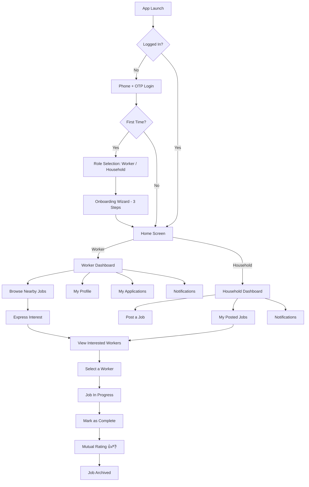
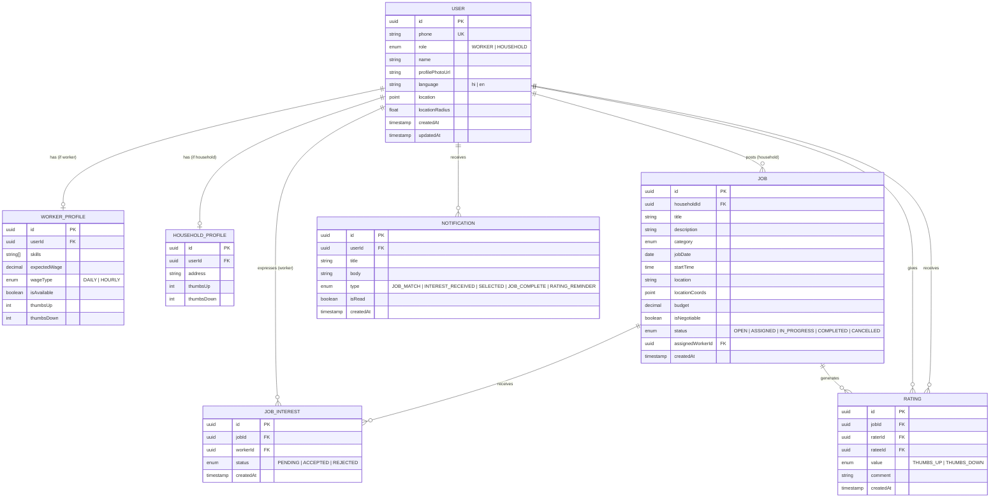

# KaamSetu — Architecture Document

## 1. High-Level Architecture

KaamSetu follows a **client–server** architecture with a Flutter mobile client communicating with a Node.js/Express backend through a REST API. Real-time features (notifications) are handled via Firebase Cloud Messaging (FCM).

```
┌─────────────────────────────────────────────────────────────────┐
│                        MOBILE CLIENT                            │
│                      (Flutter + Dart)                           │
│  ┌──────────┐ ┌──────────┐ ┌──────────┐ ┌──────────────────┐   │
│  │  Auth &   │ │  Worker  │ │Household │ │  Job Feed &      │   │
│  │ Onboard   │ │ Profile  │ │Dashboard │ │  Discovery       │   │
│  └────┬─────┘ └────┬─────┘ └────┬─────┘ └──────┬───────────┘   │
│       └─────────────┴────────────┴──────────────┘               │
│                          │  REST API (HTTPS)                    │
└──────────────────────────┼──────────────────────────────────────┘
                           │
┌──────────────────────────┼──────────────────────────────────────┐
│                     API GATEWAY / SERVER                        │
│                  (Node.js + Express.js)                         │
│  ┌──────────┐ ┌──────────┐ ┌──────────┐ ┌──────────────────┐   │
│  │  Auth     │ │  User    │ │  Job     │ │  Rating &        │   │
│  │ Service   │ │ Service  │ │ Service  │ │  Notification    │   │
│  └────┬─────┘ └────┬─────┘ └────┬─────┘ └──────┬───────────┘   │
│       └─────────────┴────────────┴──────────────┘               │
│                          │                                      │
└──────────────────────────┼──────────────────────────────────────┘
                           │
┌──────────────────────────┼──────────────────────────────────────┐
│                      DATA LAYER                                 │
│  ┌──────────────┐  ┌──────────────┐  ┌──────────────────────┐   │
│  │  PostgreSQL  │  │    Redis     │  │  Firebase (FCM +     │   │
│  │  (Primary DB)│  │   (Cache)    │  │  OTP via provider)   │   │
│  └──────────────┘  └──────────────┘  └──────────────────────┘   │
└─────────────────────────────────────────────────────────────────┘
```

---

## 2. Technical Stack

| Layer | Technology | Rationale |
|---|---|---|
| **Mobile App** | Flutter 3.x (Dart) | Cross-platform (Android-first, iOS later), excellent performance on low-end devices, rich widget library, single codebase. |
| **Navigation** | GoRouter | Declarative routing, deep-link support, redirect guards for auth. |
| **State Management** | Riverpod (flutter_riverpod) | Compile-safe, testable, no context dependency, excellent for dependency injection. |
| **API Client** | Dio | Interceptors for JWT, request/response logging, timeout handling, retry support. |
| **Local Storage** | flutter_secure_storage + shared_preferences | Secure storage for tokens, shared_preferences for settings and non-sensitive data. |
| **Backend Framework** | Node.js + Express.js | JavaScript everywhere on backend, massive package ecosystem. |
| **Database** | PostgreSQL (via Prisma ORM) | Relational data (users, jobs, ratings), strong geospatial support (PostGIS). |
| **Caching** | Redis | Session store, OTP storage (with TTL), and job feed caching. |
| **Authentication** | Custom OTP (via SMS provider like Twilio/MSG91) + JWT | Phone-first auth, no passwords, JWT for stateless session management. |
| **Push Notifications** | Firebase Cloud Messaging (firebase_messaging) | Free, reliable, works on both Android and iOS. |
| **Geolocation** | PostGIS (server-side) + geolocator (client-side) | Efficient geo-queries for "jobs near me" and radius-based search. |
| **Maps** | google_maps_flutter | Location picker for job posting, map preview on job details. |
| **File Storage** | Cloudinary or AWS S3 | Profile photo uploads. |
| **Image Handling** | image_picker + cached_network_image | Photo capture/selection and efficient image caching. |
| **i18n** | flutter_localizations + intl | Built-in Flutter localization with ICU message format support. |
| **Hosting** | Railway / Render (backend) + Neon (PostgreSQL) | Affordable, developer-friendly, easy CI/CD. |
| **Monitoring** | Sentry (sentry_flutter) + basic logging | Crash reporting on both client and server. |

---

## 3. Application Flow



---

## 4. Data Model (Entity Relationship)



---

## 5. API Endpoints (REST)

### Auth
| Method | Endpoint | Description |
|---|---|---|
| POST | `/api/auth/send-otp` | Send OTP to phone number |
| POST | `/api/auth/verify-otp` | Verify OTP and return JWT |
| POST | `/api/auth/refresh` | Refresh JWT token |

### Users & Profiles
| Method | Endpoint | Description |
|---|---|---|
| GET | `/api/users/me` | Get current user profile |
| PUT | `/api/users/me` | Update user profile |
| PUT | `/api/users/me/worker-profile` | Update worker-specific profile |
| PUT | `/api/users/me/household-profile` | Update household-specific profile |
| PATCH | `/api/users/me/availability` | Toggle worker availability |
| POST | `/api/users/me/photo` | Upload profile photo |

### Jobs
| Method | Endpoint | Description |
|---|---|---|
| POST | `/api/jobs` | Create a new job (household) |
| GET | `/api/jobs` | List jobs (with filters: location, category, date) |
| GET | `/api/jobs/:id` | Get job details |
| PATCH | `/api/jobs/:id/status` | Update job status |
| DELETE | `/api/jobs/:id` | Cancel/delete a job |
| GET | `/api/jobs/my-posts` | Household's posted jobs |

### Job Interest
| Method | Endpoint | Description |
|---|---|---|
| POST | `/api/jobs/:id/interest` | Worker expresses interest |
| GET | `/api/jobs/:id/interests` | Get all interested workers (household) |
| PATCH | `/api/jobs/:id/interests/:interestId` | Accept/reject a worker |
| GET | `/api/jobs/my-interests` | Worker's applied jobs |

### Ratings
| Method | Endpoint | Description |
|---|---|---|
| POST | `/api/jobs/:id/rate` | Submit a rating |
| GET | `/api/users/:id/ratings` | Get user's rating summary |

### Notifications
| Method | Endpoint | Description |
|---|---|---|
| GET | `/api/notifications` | Get user's notifications |
| PATCH | `/api/notifications/:id/read` | Mark notification as read |
| POST | `/api/notifications/register-token` | Register FCM device token |

---

## 6. Folder Structure

### Mobile App (Flutter / Dart)

```
kaamsetu_app/
├── android/                        # Android platform files
├── ios/                            # iOS platform files
├── pubspec.yaml                    # Dependencies & assets
├── analysis_options.yaml           # Dart linter rules
├── l10n.yaml                       # Localization config
│
├── lib/
│   ├── main.dart                   # App entry point
│   ├── app.dart                    # MaterialApp + GoRouter + ProviderScope
│   │
│   ├── core/                       # Shared foundation layer
│   │   ├── api/                    # API client
│   │   │   ├── dio_client.dart     # Dio instance with interceptors
│   │   │   ├── api_response.dart   # Generic response wrapper
│   │   │   └── api_error.dart      # Error model
│   │   │
│   │   ├── constants/              # App-wide constants
│   │   │   ├── app_constants.dart
│   │   │   ├── api_endpoints.dart
│   │   │   └── asset_paths.dart
│   │   │
│   │   ├── theme/                  # Design tokens & theme
│   │   │   ├── app_theme.dart      # ThemeData definition
│   │   │   ├── app_colors.dart     # Color palette
│   │   │   ├── app_typography.dart # Text styles
│   │   │   └── app_spacing.dart    # Spacing & sizing constants
│   │   │
│   │   ├── routing/                # GoRouter configuration
│   │   │   ├── app_router.dart     # Route definitions
│   │   │   └── route_names.dart    # Named route constants
│   │   │
│   │   ├── utils/                  # Utility functions
│   │   │   ├── formatters.dart
│   │   │   ├── validators.dart
│   │   │   └── location_helper.dart
│   │   │
│   │   └── widgets/                # Shared reusable widgets
│   │       ├── app_button.dart
│   │       ├── app_text_field.dart
│   │       ├── loading_overlay.dart
│   │       ├── error_view.dart
│   │       ├── empty_state.dart
│   │       └── shimmer_loader.dart
│   │
│   ├── features/                   # Feature-based modules
│   │   ├── auth/
│   │   │   ├── data/
│   │   │   │   ├── auth_repository.dart
│   │   │   │   └── auth_api.dart
│   │   │   ├── domain/
│   │   │   │   └── auth_state.dart
│   │   │   ├── presentation/
│   │   │   │   ├── screens/
│   │   │   │   │   ├── login_screen.dart
│   │   │   │   │   ├── otp_screen.dart
│   │   │   │   │   └── role_select_screen.dart
│   │   │   │   └── widgets/
│   │   │   │       ├── phone_input.dart
│   │   │   │       └── otp_input.dart
│   │   │   └── providers/
│   │   │       └── auth_provider.dart
│   │   │
│   │   ├── onboarding/
│   │   │   ├── presentation/
│   │   │   │   ├── screens/
│   │   │   │   │   ├── onboarding_step1.dart
│   │   │   │   │   ├── onboarding_step2_worker.dart
│   │   │   │   │   ├── onboarding_step2_household.dart
│   │   │   │   │   └── onboarding_step3.dart
│   │   │   │   └── widgets/
│   │   │   │       └── step_indicator.dart
│   │   │   └── providers/
│   │   │       └── onboarding_provider.dart
│   │   │
│   │   ├── profile/
│   │   │   ├── data/
│   │   │   │   ├── profile_repository.dart
│   │   │   │   └── profile_api.dart
│   │   │   ├── presentation/
│   │   │   │   ├── screens/
│   │   │   │   │   ├── worker_profile_screen.dart
│   │   │   │   │   └── household_profile_screen.dart
│   │   │   │   └── widgets/
│   │   │   │       ├── skill_tag.dart
│   │   │   │       ├── avatar_uploader.dart
│   │   │   │       ├── availability_toggle.dart
│   │   │   │       └── rating_badge.dart
│   │   │   └── providers/
│   │   │       └── profile_provider.dart
│   │   │
│   │   ├── jobs/
│   │   │   ├── data/
│   │   │   │   ├── jobs_repository.dart
│   │   │   │   └── jobs_api.dart
│   │   │   ├── domain/
│   │   │   │   ├── job_model.dart
│   │   │   │   └── job_filter.dart
│   │   │   ├── presentation/
│   │   │   │   ├── screens/
│   │   │   │   │   ├── job_feed_screen.dart
│   │   │   │   │   ├── job_detail_screen.dart
│   │   │   │   │   ├── post_job_screen.dart
│   │   │   │   │   ├── my_posted_jobs_screen.dart
│   │   │   │   │   ├── my_applications_screen.dart
│   │   │   │   │   ├── interested_workers_screen.dart
│   │   │   │   │   └── active_job_screen.dart
│   │   │   │   └── widgets/
│   │   │   │       ├── job_card.dart
│   │   │   │       ├── worker_card.dart
│   │   │   │       ├── category_picker.dart
│   │   │   │       ├── budget_input.dart
│   │   │   │       ├── status_badge.dart
│   │   │   │       └── interest_status_badge.dart
│   │   │   └── providers/
│   │   │       ├── jobs_provider.dart
│   │   │       └── job_interest_provider.dart
│   │   │
│   │   ├── ratings/
│   │   │   ├── data/
│   │   │   │   ├── ratings_repository.dart
│   │   │   │   └── ratings_api.dart
│   │   │   ├── presentation/
│   │   │   │   ├── screens/
│   │   │   │   │   └── rating_screen.dart
│   │   │   │   └── widgets/
│   │   │   │       └── thumbs_button.dart
│   │   │   └── providers/
│   │   │       └── ratings_provider.dart
│   │   │
│   │   ├── notifications/
│   │   │   ├── data/
│   │   │   │   ├── notifications_repository.dart
│   │   │   │   ├── notifications_api.dart
│   │   │   │   └── fcm_service.dart
│   │   │   ├── presentation/
│   │   │   │   ├── screens/
│   │   │   │   │   └── notifications_screen.dart
│   │   │   │   └── widgets/
│   │   │   │       └── notification_tile.dart
│   │   │   └── providers/
│   │   │       └── notifications_provider.dart
│   │   │
│   │   └── settings/
│   │       └── presentation/
│   │           └── screens/
│   │               └── settings_screen.dart
│   │
│   ├── l10n/                       # Localization ARB files
│   │   ├── app_en.arb              # English strings
│   │   └── app_hi.arb              # Hindi strings
│   │
│   └── models/                     # Shared data models
│       ├── user_model.dart
│       ├── worker_profile_model.dart
│       ├── household_profile_model.dart
│       ├── job_model.dart
│       ├── job_interest_model.dart
│       ├── rating_model.dart
│       └── notification_model.dart
│
├── assets/                         # Static assets
│   ├── images/
│   ├── icons/
│   └── fonts/
│
└── test/                           # Test files (mirrors lib/ structure)
    ├── features/
    │   ├── auth/
    │   ├── jobs/
    │   └── ratings/
    └── core/
```

### Backend (Node.js / Express) — *Unchanged*

```
kaamsetu-server/
├── package.json
├── tsconfig.json
├── .env.example
├── prisma/
│   ├── schema.prisma               # Database schema
│   └── migrations/                 # Auto-generated migrations
│
├── src/
│   ├── index.ts                    # Entry point — starts Express server
│   ├── app.ts                      # Express app setup, middleware, routes
│   │
│   ├── config/                     # Configuration
│   │   ├── env.ts                  # Environment variable validation
│   │   ├── database.ts             # Prisma client singleton
│   │   └── redis.ts                # Redis connection
│   │
│   ├── modules/                    # Feature-based modules
│   │   ├── auth/
│   │   │   ├── auth.controller.ts
│   │   │   ├── auth.service.ts
│   │   │   ├── auth.routes.ts
│   │   │   └── auth.validators.ts
│   │   │
│   │   ├── users/
│   │   │   ├── users.controller.ts
│   │   │   ├── users.service.ts
│   │   │   ├── users.routes.ts
│   │   │   └── users.validators.ts
│   │   │
│   │   ├── jobs/
│   │   │   ├── jobs.controller.ts
│   │   │   ├── jobs.service.ts
│   │   │   ├── jobs.routes.ts
│   │   │   └── jobs.validators.ts
│   │   │
│   │   ├── ratings/
│   │   │   ├── ratings.controller.ts
│   │   │   ├── ratings.service.ts
│   │   │   ├── ratings.routes.ts
│   │   │   └── ratings.validators.ts
│   │   │
│   │   └── notifications/
│   │       ├── notifications.controller.ts
│   │       ├── notifications.service.ts
│   │       ├── notifications.routes.ts
│   │       └── fcm.service.ts
│   │
│   ├── middleware/                  # Express middleware
│   │   ├── auth.middleware.ts       # JWT verification
│   │   ├── role.middleware.ts       # Role-based access control
│   │   ├── error.middleware.ts      # Global error handler
│   │   └── validate.middleware.ts   # Request validation (Zod)
│   │
│   ├── utils/                      # Shared utilities
│   │   ├── apiResponse.ts
│   │   ├── apiError.ts
│   │   ├── logger.ts
│   │   └── geo.ts                  # Geospatial helper functions
│   │
│   └── types/                      # Shared TypeScript types
│       └── index.ts
│
└── tests/                          # Test files
    ├── auth.test.ts
    ├── jobs.test.ts
    └── ratings.test.ts
```

---

## 7. Key Architectural Decisions

| Decision | Rationale |
|---|---|
| **Flutter over React Native** | Superior performance on low-end Android devices (compiles to native ARM), rich built-in widget set, single codebase with consistent rendering across platforms. |
| **Riverpod over BLoC/Provider** | Compile-safe, no `BuildContext` dependency, excellent testability, built-in dependency injection, and reduces boilerplate vs BLoC. |
| **GoRouter** | Declarative routing with redirect guards (auth), deep-link support, and clean URL patterns. |
| **Feature-based folder structure** | Each feature (auth, jobs, ratings) is self-contained with its own data/domain/presentation layers — scales well as the app grows. |
| **Dio over http package** | Interceptors for JWT token injection, request logging, retry logic, and timeout handling. |
| **PostgreSQL + PostGIS** | Relational data with strong geospatial query support (e.g., `ST_DWithin` for radius search). |
| **Prisma ORM** | Type-safe database access, auto-generated migrations, excellent DX. |
| **JWT + OTP (no passwords)** | Target users may struggle with passwords. Phone+OTP is familiar and frictionless. |
| **Thumbs-only rating** | Minimizes cognitive load. Workers and households give a quick 👍/👎 — no confusing 5-star scale. |
| **Hindi + English bilingual** | Critical for the target demographic. Flutter's intl + ARB localization is baked in from day one. |

---

## 8. Deployment Architecture (v1)

```
┌──────────────┐     HTTPS      ┌───────────────┐      ┌──────────────┐
│  Flutter App │ ──────────────→ │  Render /     │ ───→ │   Neon       │
│  (Android)   │                 │  Railway      │      │  PostgreSQL  │
│              │                 │  (Node.js)    │      │  + PostGIS   │
└──────────────┘                 └───────┬───────┘      └──────────────┘
                                         │
                                         ├──→ Redis Cloud (caching + OTP)
                                         │
                                         └──→ Firebase (FCM push notifications)
```

---

## 9. Key Flutter Packages

| Package | Version | Purpose |
|---|---|---|
| `flutter_riverpod` | ^2.x | State management & dependency injection |
| `go_router` | ^14.x | Declarative navigation & routing |
| `dio` | ^5.x | HTTP client with interceptors |
| `flutter_secure_storage` | ^9.x | Secure token storage (Keychain/Keystore) |
| `shared_preferences` | ^2.x | Non-sensitive local settings |
| `geolocator` | ^12.x | Device GPS location |
| `geocoding` | ^3.x | Address ↔ coordinates conversion |
| `google_maps_flutter` | ^2.x | Map widget for location picker |
| `firebase_messaging` | ^15.x | Push notifications via FCM |
| `firebase_core` | ^3.x | Firebase initialization |
| `image_picker` | ^1.x | Camera & gallery photo selection |
| `cached_network_image` | ^3.x | Efficient image caching & loading |
| `flutter_localizations` | SDK | i18n framework |
| `intl` | ^0.19.x | ICU message formatting for localization |
| `freezed` | ^2.x | Immutable data classes & union types (code gen) |
| `json_serializable` | ^6.x | JSON serialization (code gen) |
| `sentry_flutter` | ^8.x | Crash reporting & error tracking |
| `shimmer` | ^3.x | Shimmer loading placeholders |
| `flutter_svg` | ^2.x | SVG icon rendering |
